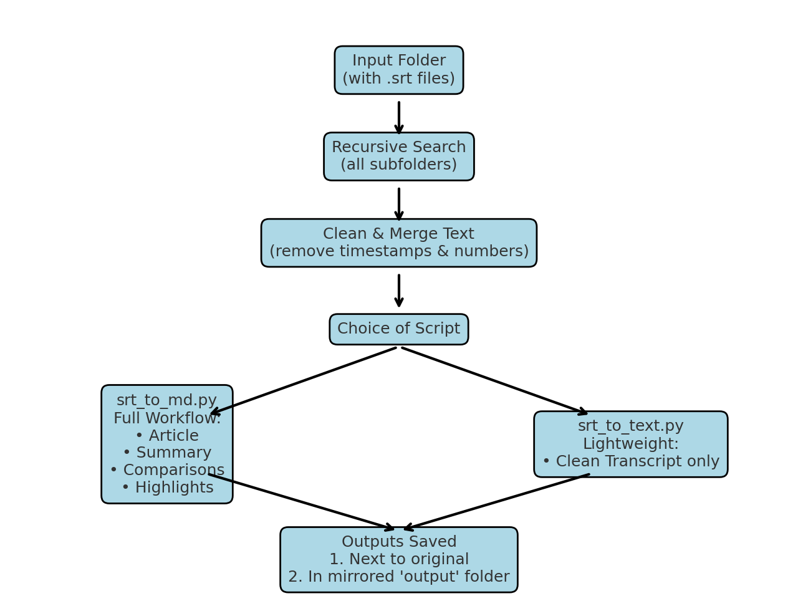

# SRT to Markdown Converter Tool


## Overview


This tool batch converts `.srt` subtitle files into cleaned Markdown outputs, including:
- Full polished article with headings and key takeaways
- Condensed one-page summary
- Full vs condensed comparison
- Full with highlighted summary sentences

It processes files **recursively**, saving outputs both:
1. **In-place** next to the original `.srt` file
2. **In a mirrored folder structure inside the `output` directory** for centralized access

## Available Scripts

### 1. `srt_to_md.py` – Full Workflow
- Cleans `.srt` into a **polished article** with:
  - Introduction, Main Discussion, Additional Insights
  - Key Takeaways
  - Condensed one-page summary
  - Full vs condensed comparison
  - Highlighted full version
- Ideal for turning transcripts into structured, ready-to-read documents.

### 2. `srt_to_text.py` – Lightweight Transcript
- Cleans `.srt` into a **simple transcript** without formatting or summaries.
- Ideal for when you only need the raw readable text.
- Much faster for bulk conversion.

## Example: From SRT to Markdown

**Input (`sample.srt`)**
```
1
00:00:00,000 --> 00:00:02,000
Hello everyone, and welcome to today's talk.

2
00:00:02,500 --> 00:00:05,000
We will explore some fascinating ideas in trading.
```

**Output (`sample_Article_Final.md`)**
```markdown
## Introduction
Hello everyone, and welcome to today's talk.

## Main Discussion
We will explore some fascinating ideas in trading.

## Additional Insights

## Key Takeaways – sample
- Identify main themes early to guide strategy and focus.
- Structure information in logical sections for clarity.
- Summarize into concise bullet points for quick recall.
- Maintain adaptability in applying lessons across contexts.
- Review key takeaways to reinforce learning.
```
